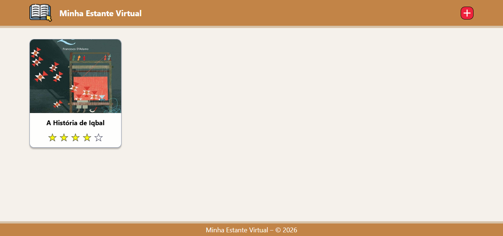

# Minha-Estante-Virtual-Dinamica

Este projeto consiste em uma Estante Virtual Dinâmica desenvolvida como uma plataforma de avaliação literária, que permite ao usuário visualizar leituras e suas avaliações. Através de uma interface composta por cards, o visitante pode navegar por livros avaliados, acessar páginas de detalhes para cada obra e adicionar avaliações própias. 

<p align="left">
  
</p>

## Sobre o Projeto

O objetivo deste site é melhorar minhas habilidades em HTML5, CSS3 e Python (microframework Flask e motor de templates Jinja2). Ele foi desenvolvido para praticar conceitos de estruturação semântica, estilização avançada, design responsivo e aplicação de Flask.

## Tecnologias

- HTML5 - Estrutura de conteúdo.
- CSS3 - Design.
- Python - Desenvolvimento back-end.

### Passos para Instalar

1. Baixe ou clone o projeto;
2. Verifique se você possui Python 3 instalado no computador.

### Como Instalar as Dependências

1. Abra o Terminal, dentro da pasta do projeto;
   
2. Execute o seguinte comando para instalar o microframework Flask:

   ```
   pip install Flask
   ```
   
## Como Acessar o Projeto no Navegador

Após baixar ou clonar o projeto, siga os passos abaixo para acessar o site.

1. Execute o seguinte comando no terminal:

No Windows:

```
python app.py
```

No Linux/macOS:

```
python3 app.py
```

2. Após executar o comando, o terminal exibirá uma mensagem semelhante:

```
Running on http://127.0.0.1:5000/
```

Copie esse endereço e digite no navegador:

```
Running on http://127.0.0.1:5000/
```

ou

```
http://localhost:5000
```

## Estrutura do Projeto

```
├── static/
│   └── assets/
│       └── images/
│           ├── Logo-Minha-Estante-Virtual.png
│           └── preview-minha-estante-virtual.png
│   └── css/
│       └── style.css
├── pages/
│   ├── add-book.html
│   ├── book-details.html
│   ├── index.html
│   └── layout.html
├── LICENSE
├── README.md
├── app.py
└── books.csv
```

## Licença 

Este projeto está licenciado sob a MIT License - veja o arquivo [LICENSE](LICENSE) para mais detalhes. 
